# RPS(LS)

[Play the game in here](https://iama3191.github.io/rock-paper-scissors-lizard-spock/)

[The repository is in here](https://github.com/iama3191/rock-paper-scissors-lizard-spock)

## Description

Rock, Paper, Scissors is a game played to settle differences between two people. The game is taught to kids to resolve their own disputes without adult intervention. However, this game requires quick thinking and perceptive reasoning.

Rock, Paper, Scissors, Lizard, Spock is an improved version of the standard game of chance "Rock Paper Scissors". It got popular when it was mentioned in the comedy 'The Big Bang Theory', but initially it was created by Sam Kass and Karen Bryla.

> I invented this game (with Karen Bryla) because it seems like when you know someone well enough, 75-80% of any Rock-Paper-Scissors games you play with that person end up in a tie. Well, here is a slight variation that reduces that probability.
>
> *-Sam Kass*

The game is available in [here.](https://iama3191.github.io/rock-paper-scissors-lizard-spock/)

### How to play?

The game has 5 options


This game has the following combinations for the victory:

- Scissors cuts paper.
- Paper covers rock.
- Rock crushes lizard.
- Lizard poisons Spock.
- Spock smashes scissors.
- Scissors decapitates lizard.
- Lizard eats paper.
- Paper disproves Spock.
- Spock vaporizes rock.
- Rock crushes scissors.

And with three possible results:

- Win
- Lose
- Draw

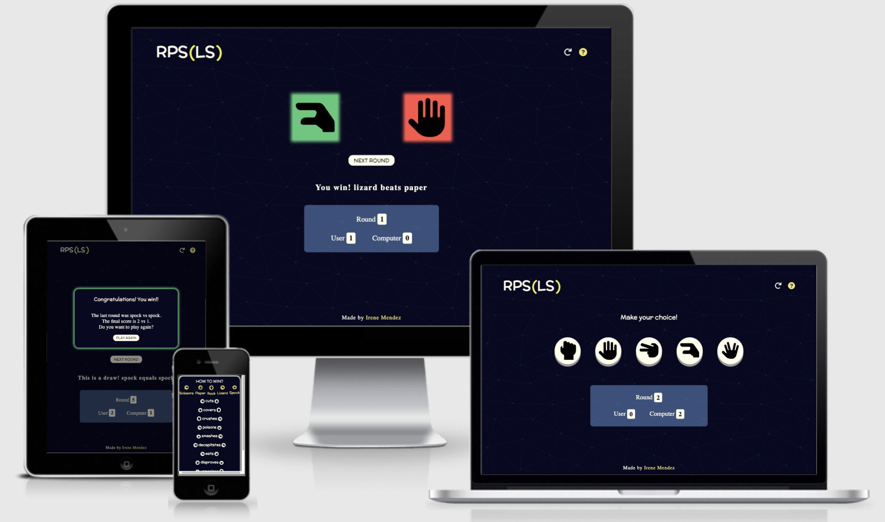

## Table of content

- [RPS(LS)](#description)

- [Table of content](#table-of-content)

- [UX Design](#ux-design)

  - [Strategy](#strategy)

    - [User Stories](#user-stories)

  - [Scope](#scope)

  - [Structure](#structure)

  - [Design](#design)

    - [Surface](#surface)

  - [Skeleton](#skeleton)

    - [Layout](#layout)

  - [Features](#features)

- [Technologies Used](#technologies-used)

  - [Lenguages used](#lenguages-used)

  - [Tools](#tools)

- [Testing](#testing)

  - [Functionality](#functionality)

  - [Google Lighthouse Test: Performance](#google-lighthouse-test-performance)

  - [Browsers](#browsers)

  - [Validators](#validators)

  - [Accessibility](#accessibility)

- [Deployment](#deployment)

- [Credits](#credits)

- [Aknowlodgements](#aknowlodgements)

## UX Design

- ## Strategy

### User Stories

Reasons a user may visit the website

- Trying an advanced level of the classic 'Rock Paper Scissors' game.

- Distracting for a few minutes from regular tasks (e.g: job).

- Playing an online game of chance against the computer.

Reasons for the website

- Give the user the opportunity to play a few rounds against a machine.

- Give the user a mentally challenging game with more options to remember.

- ## Scope

What a user may expect

- A simple way for choosing an option and facing his opponent.

- Score and round counters.

- See the computer's choice.

What a user may want

- A help button for checking the rules of the game.

- A restart button for starting a new game at any moment without waiting until the last round.

- The availability to activate the next round or a new game after the 'Game Over' screen is shown.

As a developer I expect

- To provide an easy and logical navigation of the game.

- To provide recreational and fun time with a chance game.

- To provide the opportunity for changing the main colors and fonts easily in the CSS file.

- ## Structure

The website will consist of one page:

The first layout consists in the five possible choices for the user to click on. After the user makes a decision, this container isn't displayed anymore and a new one is shown where user and computer are facing each other with the final result of the game.  
This layout is hidden once again after the user clicks on the 'next round' button.

- ## Design

### Surface

Colour Theory

The colors used for this game were chosen according to how they are appreciated in various aspects of daily life. The color-coding in the game is familiar to us, and we already know their meanings, so the game can be pretty intuitive by the colors.


The background of the web is a background image where the main color is 'Xiketic' with triangles in a clearer shade of blue from [SVGBackgrounds](SVGBackgrounds.com.) . The color 'Xiketic' is a mix of black and a little purple. Black is associated with mystery and can be easily combined with any color as well. The background has a unique and mysterious design related to the game, but the user doesn't get distracted of the web's goal.

The color green evokes powerful emotions, and it's a dominant color in nature that makes us think of growth. It is also associated with rest, security and progress. This color will highlight who is winning on each round.

The red color on nature is a warning sign, usually when something is red, it is poisonous or harmful in some way. This color will be used to highlight who is losing on each round.

The white color is bright and can create a sense of space or add highlights. This color can symbolize a new beginning or fresh start. This color will be used to highlight user's decision and for texts.

The yellow stimulates our nerves, glands and brains, makes us more alert and energetic, stimulates our memory and promotes communication. It is a color that promotes activity and interaction. For this reason, it is used for the rule button at the top of the page and to highlight a draw.

Typography

For headings and important texts, Mclaren regular 400 is used because it is a readable font with a slightly playful look that complements the rest of the site.
And for paragraphs Open San Serif is used, it is a clear and simple font that does not distract the user. And it is readable for the most important text (rules).

These fonts are imported from Google Fonts.

```text
`@import url('https://fonts.googleapis.com/css2?family=McLaren&family=Open+Sans:wght@300;400&display=swap');`
```

- ## Skeleton

### Layout

I have used media queries for maintaining the structure integrity throughout different screen sizes.  I have also set a Max-Width for the site for very large screens. In this way the designed layout won't be compromised.  
The containers are styled with paddings and margins to maintain the original design and to give a neater look to the game on small screens as well on larger ones.
The design was created using [Balsamiq Wireframes.](https://balsamiq.com/)

- #### Mobile design

*Wireframe for when the user clicks on an option and how the design changes to a new one displaying the decisions of both players.*  


*Wireframe for when the user reaches the 5th round and the final winner is picked. The user can start a new game clicking on the 'Play Again' button.*


*Wireframe for how the help is displayed when the user clicks on the help ('?') button.*


- #### Desktop design

*Wireframe for when the user clicks on an option and how the design changes to a new one displaying the decisions of both players.*  


*Wireframe for when the user reaches the 5th round and the final winner is picked. The user can start a new game clicking on the 'Play Again' button.*


*Wireframe for how the help is displayed when the user clicks on the help ('?') button.*

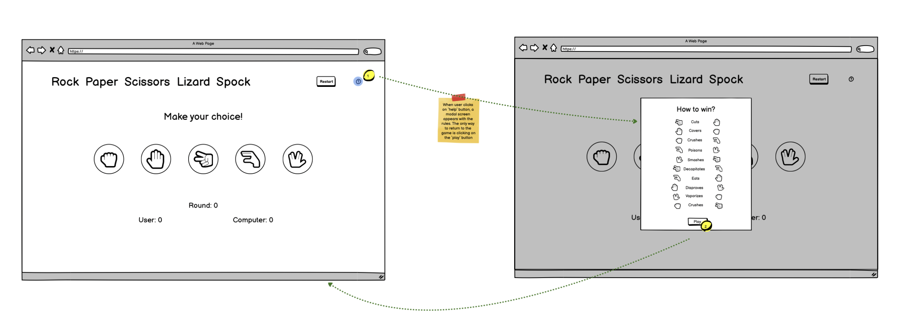

### Features

Universal Features Across the Site

Call to action

- The user's options are buttons for clicking. The style changes when the user hovers, the button looks pressed and with a highlight around it. This is for showing what option is selected.

- The 'help' and 'restart' buttons are icons that get bigger when they're on hover. This shows to the user that the buttons can be clicked.

- The 'next round' and 'play again' buttons have the same style and when they're on hover, the color and size change. In this way, the user knows that he is in control of the next action.

Imagery

I have used for the background an image from [SVG Backgrounds](https://www.svgbackgrounds.com/) where I adapted the colors to fit my color scheme.
The images shown on the buttons are from [FontAwesome](https://fonts.google.com/) with SVG format, they're in black to maintain neutrality and not getting the user confused by different colors.

Logo

For the logo I used an acronym of all the options together 'Rock Paper Scissors Lizard Spock'. The last two letters are in parenthesis because these aren't part of the original version.


The logo is an acronym for 'Rock Paper Scissors Lizard Spock'. The last two letters are in parenthesis as a simple reminder that the last options are added to the classic game we already know.

Footer

The footer has the name of the author with a link on the name for the GitHub Profile. The link opens in a new tab.
The footer is only available for screens above 500px.


Responsiveness

The website was created to be responsive for every screen size without compromising the game structure. The smallest size that was considered is of an iPhone 5/SE and the largest size is for a max-width of 2000px.  I have done this by using media queries (min-width).

Accessibility

- All fonts-sizes are set in rem unit to maintain the accessibility if the user sets the font-size of the browser.

- There is high contrast between the text color and the background color for a better readability.

- The fonts were chosen because they are easy to read, and don't present major problems for the user when he need to read.

- All headings are in descending order to make the page easier for a screen reader.

The Game Itself

- Part I: The Choice

The website has a section with the main layout where the user interacts throughout the game.  This interaction activates the rest of the game. It presents five buttons for each possible option in a single row when the user uses a wider screen size, and two rows for the smaller screens.

*Mobile design of the user's buttons*
  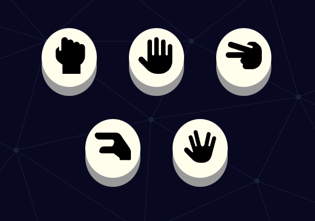

*Desktop design of the user's buttons*
  

- Part II: The Result

When a button is clicked, the buttons automatically disappear and a new container with two boxes appears. The left-hand box is the user's choice and the right-hand box is the computer's choice. Each box has a specific color for each situation. It will be yellow if it is a draw, green when the player wins and red if the player loses.

It was designed by thinking about how the person reads (from left to right, and from top to bottom). And the colors because it is natural to think in green for success, red for danger and yellow as a warning.

Below the boxes is the 'next round' button that hides the result container and show the main container with the buttons once again.

*It's a draw.*
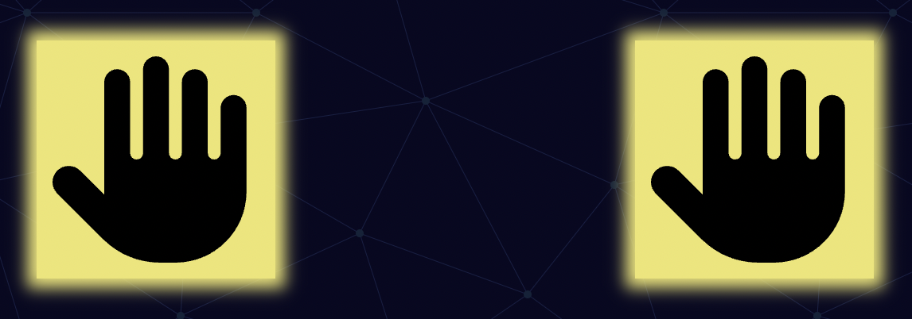

*The user wins.*


*The computer wins.*
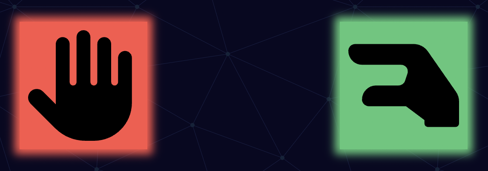

The boxes are in a row for larger screens and for smaller screens they are in columns.

*Mobile design*

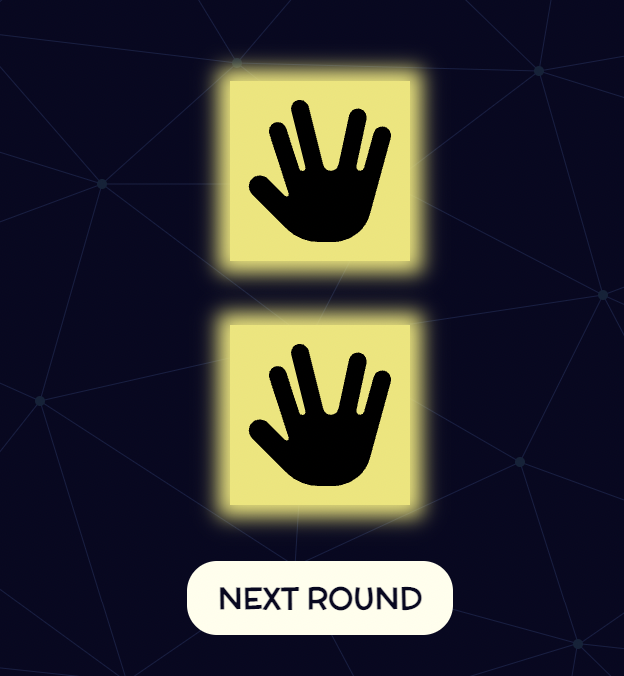

*Desktop design*


- The counters

The game features three counters: for the round, for the user's score and the computer's score.
These counters are in a container with a lighter blue as a background color,  just to get user's attention  without getting distracted from the game.

*Counters set to zero*
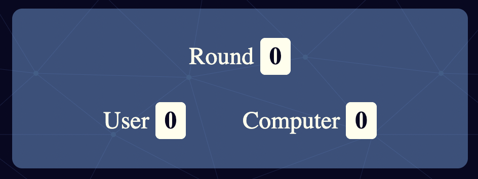

*Counters after one round*
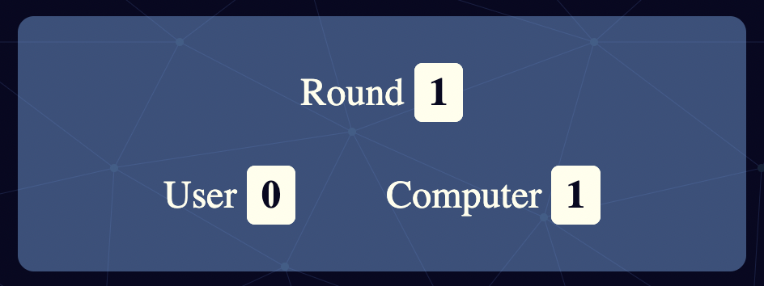

- Game Over Screen

After the fifth round is played, automatically it will appear a modal screen showing the ultimate winner of the game with the final scores. The user will have the opportunity to restart the game by clicking the 'play again' button.
The border of the container will be highlighted depending on the final result.

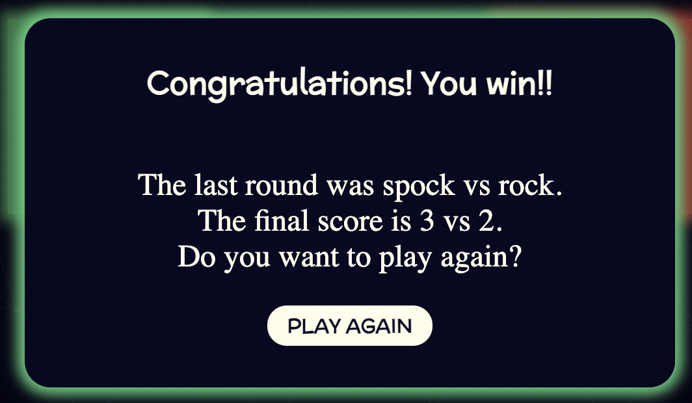

- Help Screen

Everytime the user gets confused about the rules, he can click on the help button on the top of the site, a modal screen will show with all the winning combinations and the respective name of each option in a single row after the title. The other way to return to the game is by clicking the 'play' button.

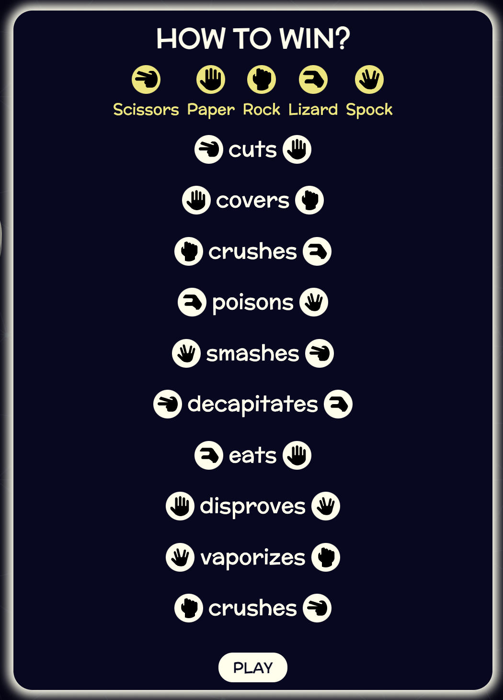

Future Features

- Add the ability to use a keypress for selecting an option and going to the next round.

- Add the ability to choose a certain number of rounds.

- Add a graphic to show user's selections and tell him if he clicks on an option more than other one.

## Technologies Used

### - Lenguages used

- HTML5: Mark-up language using semantic structure.
- CSS: Cascading style sheet used to style.
- JavaScript: Programming language.

### - Tools

- [Am I responsive](http://ami.responsivedesign.is/#): Was used to simulate how the game looks at different screen sizes.
- [Balsamiq wireframes](https://balsamiq.com/) : Was used for making wireframes of the game.
- [Beautifier](https://beautifier.io/) : Was used to organize in a better way the codes.
- [Coolors](https://coolors.co/3c3843-57db57-ede56e-ee5252-fafdf6) : Was used for checking the color contrast and finding the right shade of each color.
- [Favicon](https://favicon.io/) : Was used for generating an icon for the tab.
- [FontAwesome](https://fontawesome.com/) : Was used to add icons  and download images for a more playful website.
- [GitHub](https://github.com/) : Was used as the repository for the project's code after being pushed from Git.
- [Google fonts](https://fonts.google.com/) : Was used to import the fonts.
- [iTerm](https://iterm2.com/) : Was uset as a terminal to commit and Push to GitHub.
- [Jigsaw validator](https://jigsaw.w3.org/css-validator/) : Was used to validate the CSS file.
- [JSHint](https://jshint.com/) : Was used to validate the JavaScript file.
- [Lighthouse](https://developers.google.com/web/tools/lighthouse?hl=es) : Was used for performance tetsing.
- [Outwrite](https://www.outwrite.com/) : Was used for checking the grammar and spelling of the README file.
- [SVG Backgrounds](https://www.svgbackgrounds.com/) : Was used for selecting a background image and adapting the colors to match the color palette.
- [Table Generator](https://www.tablesgenerator.com/markdown_tables#): Was used for generating the table for the functionality test.
- [Visual Studio Code](https://code.visualstudio.com/) : Was used for version control.
- [WAVE](https://wave.webaim.org/): Was used for checking accessibility and color constrast.
- [W3C validator](https://validator.w3.org/): Was used to validate that the HTML file hasn't mistakes.

## Testing

### Functionality

| Test Label                               | Test Action                                                  | Expected Outcome                                                                                                                                                                                                                                                     | Test Outcome                                                                                                                           | Is it fixed?                                                                                                                                                                                                                                                                                                         |
|------------------------------------------|--------------------------------------------------------------|----------------------------------------------------------------------------------------------------------------------------------------------------------------------------------------------------------------------------------------------------------------------|----------------------------------------------------------------------------------------------------------------------------------------|----------------------------------------------------------------------------------------------------------------------------------------------------------------------------------------------------------------------------------------------------------------------------------------------------------------------|
| Game setup                               | User clicks on an option                                     | Buttons layout dissapears and a new container shows up with user's selection and computer's selection.                                                                                                                                                               | PASS                                                                                                                                   | /                                                                                                                                                                                                                                                                                                                    |
| Start the next round                     | User clicks on the 'next round' button                       | The original layout appears for a new game                                                                                                                                                                                                                           | PASS                                                                                                                                   | /                                                                                                                                                                                                                                                                                                                    |
| Instructions display when the user wants | User clicks on the '?' button on the top right of the screen | A modal screen shows up with the instructions without compromising the game. The only way to returning to the game is by clicking on the 'PLAY' button                                                                                                               | PASS                                                                                                                                   | /                                                                                                                                                                                                                                                                                                                    |
| Restart the game                         | User clicks on the arrow next to the '?' button              | The game is restarted no matter in what stage is the user. If he clicks on it, the original container with the 5 buttons will be shown, and the scores will set to '0'                                                                                               | PASS                                                                                                                                   | /                                                                                                                                                                                                                                                                                                                    |
| Game over message                        | User plays the 5th round                                     | After the user gets the results of the last round, a modal will show with the final results and scores. The user will have the choice to start a new game by clicking 'PLAY AGAIN'. The layouts are restored to their original design and the scores are set to '0'. | FAIL When the user finishes the next 5 rounds, the modal screen for the game over message appears with a repeated 'PLAY AGAIN' button. | The function for creating the modal screen was called everytime the number of rounds equals '5'. In this function, elements are created but are not modified, a new button was created over and over again. The function was changed to be called after the DOM is loaded. And is modified depending on the results. |

### Google Lighthouse Test: Performance

The first test was made for mobile devices, the score was 83% with a warning about Google Chrome extensions.

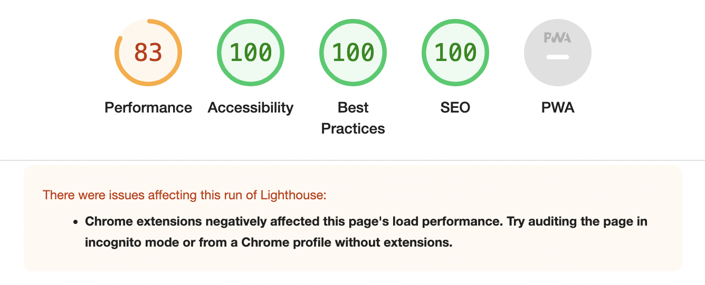

All Chrome extensions were disabled and  preconnecting links were added to the HTML file for third-party code (Google Fonts and FontAwesome), and I repeated the test on mobile devices, the score got up to 99%.


The performance test for desktop was made only after extensions were disabled, getting a score of 100%.


### Browsers

**Google Chrome Version 99.0.4844.51 (Official Build) (arm64):**

This browser was used for the development and test stages.

**Safari Version 15.3 (17612.4.9.1.8):**

This was used for the test stage. I used the developer tools to verify the responsive design on all screen sizes.

### Validators

- W3C HTML Test: Code passed the test without warnings or erros.

- W3C Jigsaw CSS Test: Code passed the test without errors.

- JSHint Test: Code passed the test without any important warnings.

### Accessibility

[WAVE](https://wave.webaim.org/) was used for testing the accessibility of the site. For the first test, the results were that the buttons didn't have 'aria-label', I added the attributes for all buttons and run the test again. The results were better and didn't show errors.
This web also checked the color contrast and the tests were passed.

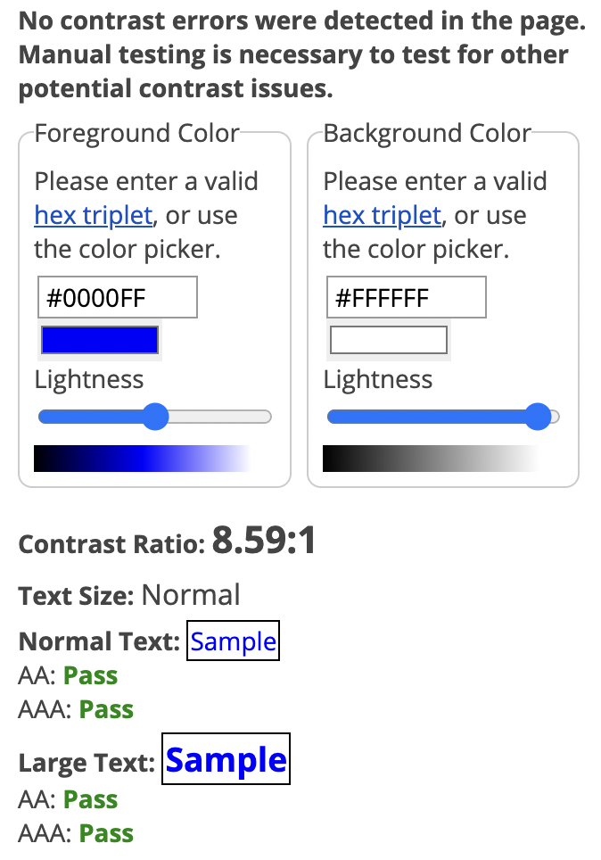

### User stories

I asked a couple of friends to check the game without explaining anything else. They went through the game without any problem, even though they didn't know what the 'lizard' and 'spock' options were.  For this reason, I added to the help modal screen  the name of each option.

## Deployment

### HOW THIS SITE WAS DEPLOYED

1. In the GitHub repository of the website, go to the "Settings", and click.

2. In the menu on the left side of the screen, go to the "Code and Automation" and click on "Pages".

3. Under the GitHub Pages, select the Main Branch from the dropdown menu.

4. Optionally select the folder in the following dropdown menu.

5. Save and automatically the site is published.


### HOW TO FORK THE REPOSITORY

1. Go to the website's repository on Github.

2. Go to the "Fork" button on the right side of the screen and click.

3. Now you have a copy of the repository into your own GitHub account to make changes without affecting the original repository.

### HOW TO CLONE THIS SITE

1. Go to the website's repository  <https://github.com/iama3191/rock-paper-scissors-lizard-spock> on GitHub.

2. Click the "Code" button on the left side of the green "Gitpod" button.

3. Click the HTTPS and copy the link.

4. Open Gitbash.

5. Change the current working directory to where you want the cloned directory to be.

6. Type `git clone`, and then paste the URL you copied earlier.

7. To make changes to the website:

    7.1. Update the code as needed.

    7.2. Go to the terminal and add `git add .`

    7.3. Add `git commit -m "brief description of the update"`

    7.4. Add `git push`.

Any updates commited to the Main Branch inmediately reflect in the hosted site.

## Credits

- Mentor support, guidance, and tips to improve my coding skills throughout the project:
  - Brian Macharia

- Creator of the game:
  - Sam Kass with Karen Bryla.

- The Big Bang Theory TV show for the visual explanation:

  - <https://www.youtube.com/watch?v=x5Q6-wMx-K8>

- Information of the game:

  - <https://cjleo.com/2020/05/25/why-we-dont-play-rock-paper-scissors-lizard-spock/>

- Checking code information:
  - <https://developer.mozilla.org/>
  - <https://www.w3schools.com/>
  - <https://www.javascripttutorial.net/dom/css/check-if-an-element-contains-a-class/>

  ```JavaScript
  element.classList.contains(className);
  ```

  - <https://www.educative.io/edpresso/how-to-add-an-id-to-element-in-javascript>

  ```JavaScript
  terms.setAttribute(‘id’,‘para-1’);
  ```

- Checking functionality of the game and giving constantly feedback:

  - Petar Hrgetić Vitols
  
- Checking use on mobile (iPhone SE 2nd generation):

  - Anna Mara Hrgetić Vitols

- Tutorial for using an array of objects for the game, and adapting to my vision:

  - [Web Dev Simplified](https://www.youtube.com/watch?v=1yS-JV4fWqY&t=783s)

  ```text
  const selection = SELECTIONS.find(selection => selection.name === selectionName)
  ```

- Information for color psychology:

  - <https://www.sensationalcolor.com/color-psychology/>
  - <https://www.colormatters.com/color-and-design/why-color-matters>

- Information for checking how to use markdown for the README file:

  - <https://www.markdownguide.org/basic-syntax/#images-1>

- Information about docstrings for JavaScript
  - <https://www.valentinog.com/blog/jsdoc/>
  - <https://devhints.io/jsdoc>

- Love Math Project for explaining how to use JavaScript:
  - <https://github.com/Code-Institute-Org/love-maths>

- Table generator with mardown style guide:
  - <https://www.tablesgenerator.com/markdown_tables#>

## Aknowlodgements

This game was built as my second project for [Code Institute](https://codeinstitute.net/global/).
