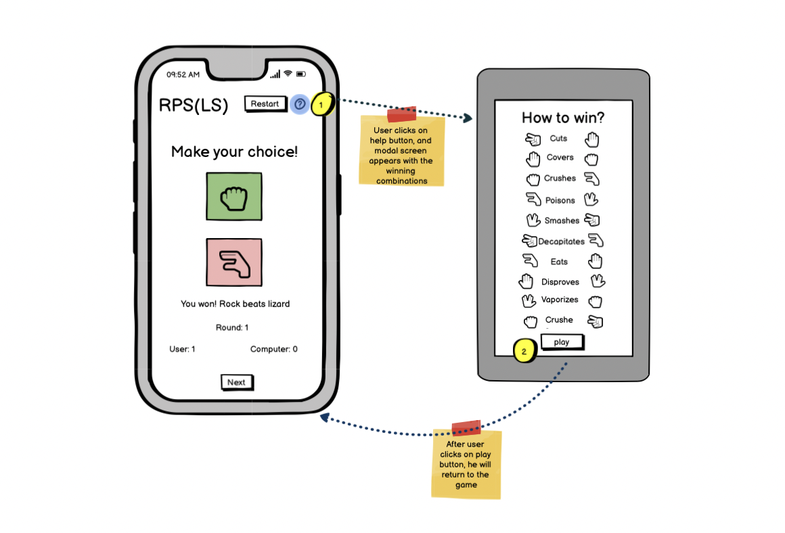
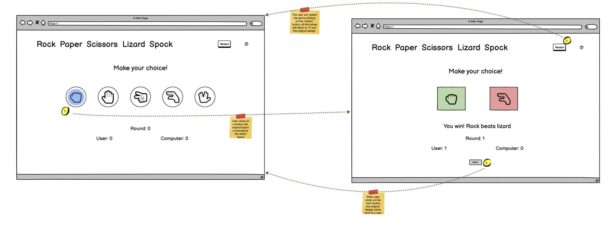

# Rock, Paper, Scissors, Lizard, Spock

## Description

Rock, Paper, Scissors is a game played to settle differences between two people. The game is taught to kids to resolve their own disputes without adult intervention. However, this game requires quick thinking and perceptive reasoning.

Rock, Paper, Scissors, Lizard, Spock is an improved version of the standard game of chance "Rock Paper Scissors". It got popular when it was mentioned in the comedy 'The Big Bang Theory', but initially it was created by Sam Kass and Karen Bryla.

> I invented this game (with Karen Bryla) because it seems like when you know someone well enough, 75-80% of any Rock-Paper-Scissors games you play with that person end up in a tie. Well, here is a slight variation that reduces that probability.
>
> *-Sam Kass*

The game is available in [here.](https://iama3191.github.io/rock-paper-scissors-lizard-spock/)

### How to play?

This game has the following combinations for the victory:

- Scissors cut paper.
- Paper covers rock.
- Rock crushes lizard.
- Lizard poisons Spock.
- Spock smashes scissors.
- Scissors decapitate lizard.
- Lizard eats paper.
- Paper disproves Spock.
- Spock vaporizes rock.
- Rock crushes scissors.

And with three possible results:

- Win
- Lose
- Draw

// Add pictures from Am I responsive.

## Table of content

- [RPS(LS)](#description)

- [Table of content](#table-of-content)

- [UX Design](#ux-design)
  - [User Stories](#user-stories)
  - [Colour Theory](#colour-theory)
  - [Typography](#typography)
  - [Features](#features)
    - [Navigation bar](#navigation-bar)
    - [Help button](#help-button)
    - [RPS(LS): The game itself](#rpsls-the-game-itself)
    - [Wireframes](#wireframes)

- [Technologies Used](#technologies-used)
  - [Lenguages used](#lenguages-used)
  - [Tools](#tools)
- [Testing](#testing)
  - [Navigation](#navigation)

  - [Game Functionality Test 1: Handling Clicks](#game-functionality-test-1-handling-clicks)
  - [W3C HTML Test:](w3c-html-test)
  - [W3C Jigsaw CSS Test:](#w3c-jigsaw-css-test)
  - [JSHint Test:](#jshint-test)
  - [Google Lighthouse Test #1: Performance:](google-lighthouse-test-1-performance)

- [Deployment](#deployment)
- [Credits](#credits)
- [Aknowlodgements](#aknowlodgements)

## UX Design

### User stories

### Colour Theory

The colors used for this game were chosen according to how they are appreciated in various aspects of daily life. The color-coding in the game is familiar to us, and we already know their meanings, so the game can be pretty intuitive by the colors.

The background of the web is a background image where the main color is 'Xiketic' with triangles in a clearer shade of blue from [SVGBackgrounds](SVGBackgrounds.com.) . The color 'Xiketic' is a mix of black and a little purple. Black is associated with mystery and can be easily combined with any color as well. The background has a unique and mysterious design related to the game, but the user doesn't get distracted of the web's goal.

The color green evokes powerful emotions, and it's a dominant color in nature that makes us think of growth. It is also associated with rest, security and progress. This color will highlight who is winning on each round.

The red color on nature is a warning sign, usually when something is red, it is poisonous or harmful in some way. This color will be used to highlight who is losing on each round.

The white color is bright and can create a sense of space or add highlights. This color can symbolize a new beginning or fresh start. This color will be used to highlight user's decision and for texts.

The yellow stimulates our nerves, glands and brains, makes us more alert and energetic, stimulates our memory and promotes communication. It is a color that promotes activity and interaction. For this reason, it is used for the rule button at the top of the page and to highlight a draw.

### Typography

For headings and important texts, Mclaren regular 400 is used because it is a readable font with a slightly playful look that complements the rest of the site.
And for paragraphs Open San Serif is used, it is a clear and simple font that does not distract the user. And it is readable for the most important text (rules).

These fonts are imported from Google Fonts.

>`@import url('https://fonts.googleapis.com/css2?family=McLaren&family=Open+Sans:wght@300;400&display=swap');`

### Features

1. ### Call to action

2. ### RPS(LS): The game itself

3. ### Wireframes

- #### MOBILE

*Wireframe for when the user clicks on an option and how the design changes to a new one displaying the decisions of both players.*  

*Wireframe for when the user reaches the 5th round and the final winner is picked. The user can start a new game clicking on the 'Play Again' button.*

*Wireframe for how the help is displayed when the user clicks on the help ('?') button.*

- #### DESKTOP

*Wireframe for when the user clicks on an option and how the design changes to a new one displaying the decisions of both players.*  

*Wireframe for when the user reaches the 5th round and the final winner is picked. The user can start a new game clicking on the 'Play Again' button.*

*Wireframe for how the help is displayed when the user clicks on the help ('?') button.*

## Technologies Used

### - Lenguages used

- HTML5
- CSS
- JavaScript

### - Tools

- [Am I responsive](http://ami.responsivedesign.is/#): Was used to simulate how the game looks at different screen sizes.
- [Balsamiq wireframes](<https://balsamiq.com/>) : Was used for making wireframes of the game.
- [Beautifier](https://beautifier.io/) : Was used to organize in a better way the codes.
- [Coolors](https://coolors.co/3c3843-57db57-ede56e-ee5252-fafdf6) : Was used for checking the color contrast and finding the right shade of each color.
- [FontAwesome](https://fontawesome.com/) : Was used to add icons  and download images for a more playful website.
- [GitHub](https://github.com/) : Was used as the repository for the project's code after being pushed from Git.
- [Google fonts](https://fonts.google.com/) : Was used to import the fonts.
- [iTerm](https://iterm2.com/) : Was uset as a terminal to commit and Push to GitHub.
- [Jigsaw validator](https://jigsaw.w3.org/css-validator/) : Was used to validate the CSS file.
- [JSHint](https://jshint.com/) : Was used to validate the JavaScript file.
- [Outwrite](https://www.outwrite.com/) : Was used for checking the grammar and spelling of the README file.
- [Visual Studio Code](https://code.visualstudio.com/) : Was used for version control.-
- [W3C validator](https://validator.w3.org/): Was used to validate that the HTML file hasn't mistakes.

## Testing

1. ### Navigation

2. ### Game Functionality Test 1: Handling Clicks

3. ### Google Lighthouse Test #1: Performance

4. ### Browsers

5. ### Validators

- W3C HTML Test: Code passed the test without warnings or erros.

- W3C Jigsaw CSS Test: Code passed the test without errors.

- JSHint Test: Code passed the test without any important warnings.

## Deployment

### HOW THIS SITE WAS DEPLOYED

1. In the GitHub repository of the website, go to the "Settings", and click.

2. In the menu on the left side of the screen, go to the "Code and Automation" and click on "Pages".

3. Under the GitHub Pages, select the Main Branch from the dropdown menu.

4. Optionally select the folder in the following dropdown menu.

5. Save and automatically the site is published.

### HOW TO FORK THE REPOSITORY

1. Go to the website's repository on Github.

2. Go to the "Fork" button on the right side of the screen and click.

3. Now you have a copy of the repository into your own GitHub account to make changes without affecting the original repository.

### HOW TO CLONE THIS SITE

1. Go to the website's repository  <https://github.com/iama3191/rock-paper-scissors-lizard-spock> on GitHub.

2. Click the "Code" button on the left side of the green "Gitpod" button.

3. Click the HTTPS and copy the link.

4. Open Gitbash.

5. Change the current working directory to where you want the cloned directory to be.

6. Type `git clone`, and then paste the URL you copied earlier.

7. To make changes to the website:

    7.1. Update the code as needed.

    7.2. Go to the terminal and add `git add .`

    7.3. Add `git commit -m "brief description of the update"`

    7.4. Add `git push`

Any updates commited to the Main Branch inmediately reflect in the hosted site.

## Credits

Information of the game: <https://cjleo.com/2020/05/25/why-we-dont-play-rock-paper-scissors-lizard-spock/>

## Aknowlodgements
